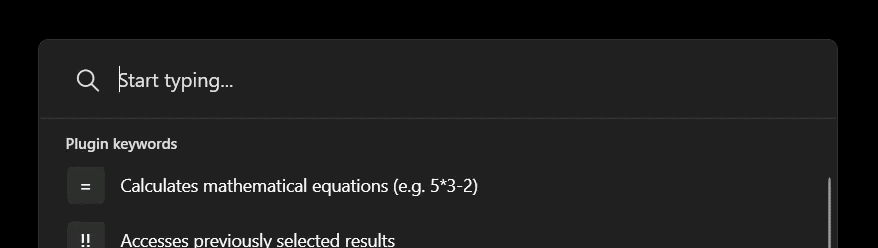
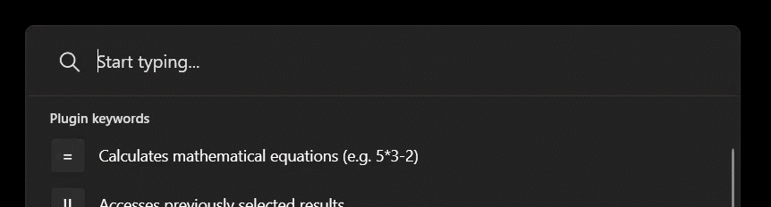
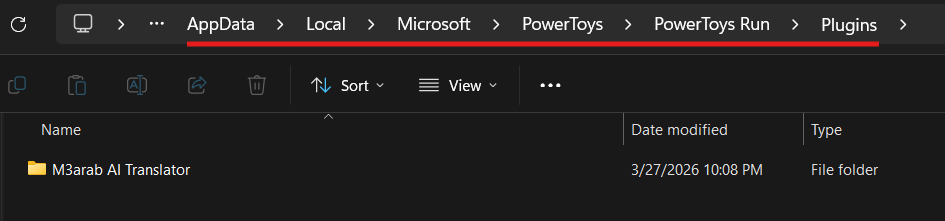

  

 <h1 align="center"> M3arab Translator </h1>
<h2 align="center"> A&ensp;PowerToys Run &ensp; Plugin </h2>

&nbsp;

A PowerToys Run plugin that converts Kuwaiti M3arab / Arabizi into Arabic script using the OpenAI Responses API.

&nbsp;

&nbsp;

<h3 align="center"> <i>READ <a href="#installation">INSTALLATION INSTRUCTIONS</a> AT THE VERY LEAST PLEASE</i> </h3>

&nbsp;

&nbsp;

## Table of Contents
- [What it does](#what-it-does)
- [Demo: Reasoning Tradeoff](#demo-reasoning-tradeoff)
- [Usage](#usage)
- [Settings](#settings)
- [Known Limitations](#known-limitations)
- [Installation](#installation)
- [OpenAI API Key Information](#openai-api-key-information)
- [Rough API Cost](#rough-api-cost)
- [For Developers](#for-developers)

  &nbsp;

  &nbsp;
  
## What it does

- Converts Kuwaiti M3arab / Arabizi into Arabic script
- Uses configurable OpenAI instructions from PowerToys settings
- Copies the result to the clipboard when selected
- Lets you configure:
  - **OpenAI API key**
  - **AI model** to generate translation
  - **instructions** to the model for translating
  - **reasoning effort** (how long the model should think)
 
    &nbsp;

    &nbsp;

## Demo: Reasoning Tradeoff

The model is not perfectly reliable on difficult slang, profanity, fused words, or ambiguous spellings.

Prefixing a query with `.` temporarily increases reasoning effort by one step for that request only:

- `minimal -> low`
- `low -> medium`
- `medium -> high`
- `high -> high`

(These reasoning effort levels can also be set permanently in the plugin settings, so a `.` wouldn't have to be placed every time.)

This can improve some outputs, but it also adds latency and still does not guarantee perfect accuracy. 

**It is not recommended to use medium or high as they tend to take an unreasonable amount of time for simple prompts. Use only if desperate.**

 Demo showcasing `minimal` vs `low` reasoning effort levels. 

&nbsp;

&nbsp;

## Usage

1. Launch PowerToys Run (alt+space)
2. Typing **kw** will activate M3arab Translator
3. Type your query directly after a space (or after a space and a `.`).
4. Pressing tab once the response is generated will select it and pressing Enter with it selected will copy the result to your clipboard.

### Examples

Open PowerToys Run (alt+space) and type:

    kw shrayik

Temporary reasoning bump for a single query (more accurate but takes longer):

    kw . shrayik

Pro-tip: you can include multiple dots `.` to step up in reasoning further, in case one isn't enough,     
**but it isn't recommended to step up reasoning too far as it will increase reasoning time by *a lot*.**

&nbsp;

&nbsp;

## Settings

In PowerToys  :

`PowerToys Settings -> Utilities -> PowerToys Run -> Plugins -> M3arab Translator`

**You MUST Configure:**

- `OpenAI API Key`

**You will need an API key from OpenAI.** Look [**below**](#openai-api-key-information) for more information.

The following may be configured to your liking but come with default values:

- `OpenAI Model` - Which AI model to use for translations, leave as-is unless you are knowledgeable in AI
- `Instructions` - Translation instructions, works fine as-is but you may edit if you have more specific instructions
- `Reasoning Effort` - How long the AI should think, default is "minimal" for snappy responses, but you may set to either "low", "medium", or "high" for longer thinking time (and hopefully better translations... hopefully).
  
  **Setting to "medium" and "high" is not recommended to set as default due to how unreasonably long they take.**

&nbsp;

&nbsp;

## Known Limitations

- This is not a deterministic transliterator.
- The model can still misread slang, profanity, fused words, or ambiguous Kuwaiti spellings.
- Higher reasoning effort may improve some outputs, but also increases latency.
- Output quality depends heavily on the active instructions and the model being used.

&nbsp;

&nbsp;

## Installation

**Pre-Requisites:**

1. Install [PowerToys](https://github.com/microsoft/powertoys/releases) and enable PowerToys Run in its settings if not already enabled.
2. Have a configured [OpenAI API Key](https://platform.openai.com/api-keys), look [below](#openai-api-key-information) for more information.

**Plugin Installation:**

1. Download the [latest release files](https://github.com/evorm/Community.PowerToys.Run.Plugin.M3arabTranslator/releases/latest).
2. Extract the zip, then copy the plugin folder into your PowerToys Run plugins directory.
3. Restart PowerToys.
4. Open PowerToys Settings (right click the  icon in drop-down at bottom right of taskbar, click Settings) 
5. Navigate to `Utilities -> PowerToys Run -> Plugins -> M3arab Translator` > Paste your [OpenAI API Key](#openai-api-key-information) here.
6. Done! Check [Usage](#usage) for further instructions.

&nbsp;

Typical user plugin path (paste this into the top bar in File Explorer):

    %LOCALAPPDATA%\Microsoft\PowerToys\PowerToys Run\Plugins\

&nbsp;

&nbsp;

## OpenAI API Key Information 

This plugin uses the **OpenAI API**, so you need your **own API key** and **API billing**.    
A normal ChatGPT subscription does **not** cover API usage.

### How to get an API key

1. Go to the [OpenAI API Keys page](https://platform.openai.com/api-keys).
2. Click **Create new secret key**.
3. Copy the key right away and save it somewhere safe.
4. Paste it into this plugin’s settings in PowerToys Run.

OpenAI says API keys are created at the **project** level, and you should keep them private. 

### How to add billing

1. Open the [Billing Overview](https://platform.openai.com/settings/organization/billing/overview).
2. Add your payment details.
3. Buy prepaid credits if you want a fixed spending buffer. **Make sure to turn off auto recharge if you do not intend to automatically pay once it runs out**.

OpenAI supports **prepaid billing**. The minimum prepaid purchase is **$5**. Prepaid credits expire after **1 year** and are **non-refundable**.

&nbsp;

&nbsp;

## Rough API Cost

This plugin usually sends a **small GPT-5 nano request**. OpenAI’s published pricing for GPT-5 nano is:

- **Input:** $0.05 per 1 million tokens
- **Output:** $0.40 per 1 million tokens

In normal use, this plugin is usually **very cheap** (especially on `minimal` reasoning).

A typical `minimal` query is roughly:
- about **150–250 input tokens**
- about **10–40 output tokens**

That works out to roughly:

- **about $0.00001 to $0.00003 per request**
- **about $0.001 to $0.003 for 100 requests**
- **about $0.10 to $0.30 for 10,000 requests**

Those are rough estimates, not guarantees, but the point is simple: a few normal transliteration requests cost basically nothing.

### What happens if you use `low`, `medium`, or `high` reasoning?

The prices above are the **baseline** for short requests and assume the model does not spend much extra effort reasoning.

With **GPT-5 nano**, extra reasoning can increase cost because **reasoning tokens are billed as output tokens**. OpenAI notes that reasoning-token usage can range from **a few hundred to tens of thousands** depending on task complexity.

#### So, very roughly, if your baseline estimate is:

- **about $0.10 to $0.30 per 10,000 requests** on `minimal`

#### then you can think of it like this:

- **`minimal`**: about **$0.10 to $0.30 per 10,000 requests**
- **`low`**: about **$0.50 to $0.70 per 10,000 requests**
- **`medium`**: about **$2.10 to $2.30 per 10,000 requests**
- **`high`**: about **$4.10 to $4.30 per 10,000 requests**

### Important

- Keep your API key private.
- Do **not** post it publicly or commit it to GitHub.
- If the key is leaked, delete it and make a new one from the same API Keys page.

&nbsp;

&nbsp;

## For Developers
### Release contents

A release should include the runtime files only, such as:

- `Community.PowerToys.Run.Plugin.M3arabTranslator.dll`
- `plugin.json`
- `Images/icon.png`
- any required dependency DLLs

Do not ship source files, `bin/`, or `obj/` in the release zip.

### Building

From the project folder:

    dotnet build -c Release

### Source layout

Important project files:

- `Main.cs`
- `plugin.json`
- `Images/icon.png`
- `Community.PowerToys.Run.Plugin.M3arabTranslator.csproj`
- `lib/Wox.Plugin.dll` from PowerToys v0.98.1
- `lib/PowerToys.Settings.UI.Lib.dll` from PowerToys v0.98.1

Generated folders like `bin/` and `obj/` should not be committed.

&nbsp;

## Credits

- Logo: https://ar.wikipedia.org/wiki/%D8%B9%D9%8A%D9%86_(%D8%AD%D8%B1%D9%81) 
- PowerToys icon: https://commons.wikimedia.org/wiki/File:2020_PowerToys_Icon.svg

&nbsp;
   
## License

[MIT](LICENSE)
